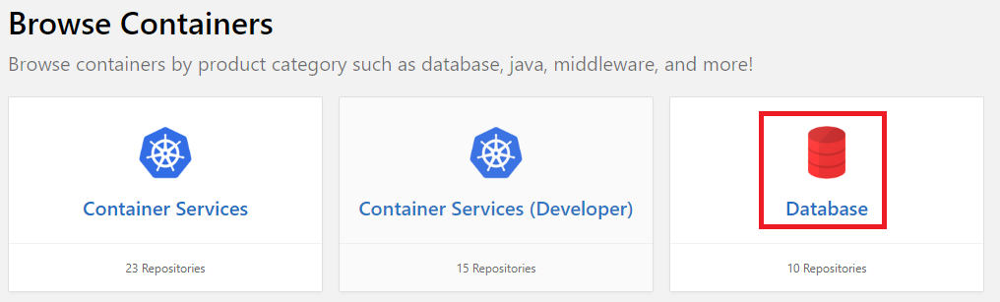
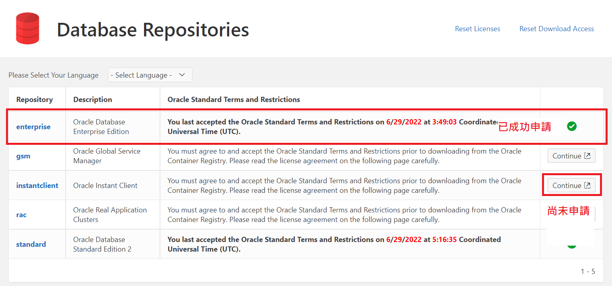
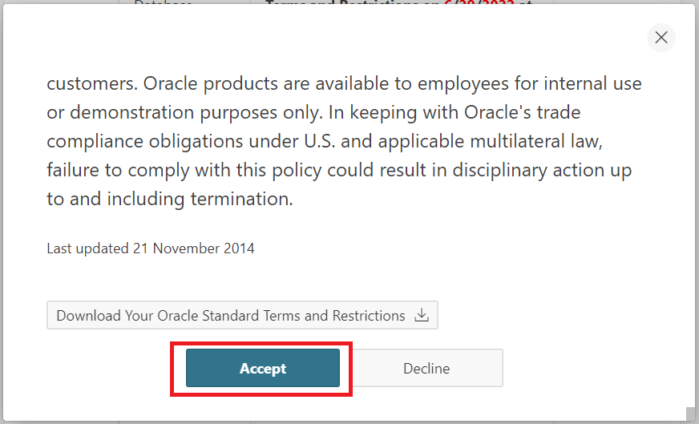

# 前言

之前的我都是去 docker hub pull, 

但是今天發現 docker pull 的方式不一樣了。

# 直接寫解法

## 前往 oracle container 註冊：
    
    https://container-registry.oracle.com

## 登入完後，點擊 Database



## 同意授權



```
請記得要點擊 Continue.
```

## 授權



```
顯示打勾之後，再繼續下面的操作。
```

## docker login

看你的環境是什麼，我今天使用的公司電腦，所以以下使用 Windows 的 PowerShell。

注意：這邊的話會叫你輸入登入資訊，但是因為我已經登入過了。

注意：這邊的話會叫你輸入登入資訊，但是因為我已經登入過了。

注意：這邊的話會叫你輸入登入資訊，但是因為我已經登入過了。


```
PS D:\> docker login container-registry.oracle.com
Authenticating with existing credentials...
Login Succeeded
```

這時候就可以下載 container-registry.oracle.com 的 images ，

你可以先 COPY 下面的指令。

```
docker run -d --name oracle-db container-registry.oracle.com/database/enterprise:21.3.0.0
```

這邊是測試，使用 docker run 來下載 container-registry.oracle.com 的 image.

```
PS D:\> docker run -d --name oracle-db container-registry.oracle.com/database/enterprise:21.3.0.0
Unable to find image 'container-registry.oracle.com/database/enterprise:21.3.0.0' locally
21.3.0.0: Pulling from database/enterprise
401a42e1eb4f: Pulling fs layer
a13a3f09d2fa: Pulling fs layer
a55a58a3063b: Pulling fs layer
d6422a9150b2: Pulling fs layer
..... 以下太多資訊 省略
```

## 完成