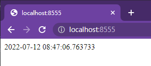

# 前言

主要就是將原始程式碼轉成暗碼，雖然能夠不讓自己的程式碼直接裸奔。

但是若碰到有心人士也是一樣可以透過逆向工程把你的程式碼還原。

提到明碼轉成暗碼，優先選擇 Cython 來執行，速度甚至可能變快(?)，實際上當然還沒測試，只是看到非常多人透過 Cython 讓自己 Python 程式碼變快 XD

真是期待，但今天並不是來測試效能，而是優先將 Django-app 轉換成 so 檔執行 !!

# 操作

可以參考 Reference 第一篇文章的程式碼來執行，但是我這邊主要也是整理一下我自己實作的部分提供參考。

## 操作環境

使用 WSL2，要注意如果使用 Windows 進行 Cython，

在執行上面有跑出問題，所以我是放棄了。

```sh
root@DESKTOP-xxx:/mnt/c/Users/xxx# lsb_release -a
No LSB modules are available.
Distributor ID: Ubuntu
Description:    Ubuntu 18.04.6 LTS
Release:        18.04
Codename:       bionic
```

## 資料夾架構

```shell
root@DESKTOP-xxx:/core$ tree -L 3
.
├── README.md
├── apps
│   └── app1
│       ├── __init__.py
│       ├── admin.py
│       ├── apps.py
│       ├── functions
│       ├── migrations
│       ├── models.py
│       ├── tests.py
│       ├── urls.py
│       └── views.py
├── build_clear.py
├── build_py_to_so.py # 本文主角
├── core
│   ├── __init__.py
│   ├── asgi.py
│   ├── settings.py
│   ├── urls.py
│   ├── variables.py
│   └── wsgi.py
├── logs
│   └── debug.log
├── manage.py
├── requirements.txt
├── run_venv.sh
├── templates
└── venv
```

其中最重要的就是 ```build_py_to_so.py``` 這支檔案，待會會將程式碼貼在本文。

另外為了防止疑惑，以下說明其他資料夾的內容

- 關於 Django
  - core - 為 django project 主要資料夾
  - apps - 為 django app 生成的位置，如果建立在主目錄會非常亂
  - logs - 儲存 log 檔的資料夾
  - templates - 儲存 html 檔的資料夾
  - manage.py - django 預設
- 關於 Python
  - venv - 虛擬環境
  - requirements.txt - pip freeze, 為需要用的的套件
  - build_clear.py - 自動清理 ```.py```、```.c``` 檔案，建議參考 Reference 第一篇文章
    - 程式碼連結：<https://gist.github.com/CHunYenc/adcdd234aab33d621fdfa127e41ee16a>
- 其他
  - run_venv.sh

## 如何將 APP 從 py 轉為 cython

### build_py_to_so.py

### 導入套件

```python3
from distutils.core import setup
from distutils.extension import Extension
from Cython.Build import cythonize
from Cython.Distutils import build_ext
import Cython.Compiler
import os
```

上面是使用到的套件，非常簡單，大部分都是 import Cython 套件。

### 取得 app 路徑

``` python3
# app 的資料夾名稱
app_name = "app1" 
# app 使用 function 資料夾架構
functions_name = "functions" 

# 取得 app1 資料夾路徑
app_folder = os.path.join(os.path.join(os.getcwd(), 'apps'), app_name)
# 取得 app1/functions/*.py 
function_file = os.path.join(os.path.join(app_folder, 'functions'), '*.py')
# 取得 app1/*.py
app_file = os.path.join(app_folder, '*.py')
```

上面是取得資料夾的一些路徑，如果你有非常多的 app 要把程式碼轉為 cython，

那也可以將你的 apps 使用 ```os.path.join```，路徑的話應該會是 ```apps/**/*.py```。

注意：```app1/migrations/```，在執行的時候無法使用 Cython ， 會出錯誤。

注意：```app1/migrations/```，在執行的時候無法使用 Cython ， 會出錯誤。

注意：```app1/migrations/```，在執行的時候無法使用 Cython ， 會出錯誤。

> 若你解決了，可以再留言跟我分享，你的方式。

### 主要程式碼

這邊如果你是參考 Reference 第一篇文章的話，他是沒有第 3 行迴圈的部分，

這邊我主要是忽略 ```app1/migrations/``` 資料夾產生的錯誤。

```python3
def to_so():
    format_folder = [app_file, function_file]
    for i in format_folder:
        try:
            ext_modules = [Extension('*', [i], )]
            setup(
                name="py to so",
                cmdclass={'build_ext': build_ext},
                ext_modules=cythonize(ext_modules, language_level="3")
            )
        except Cython.Compiler.Errors.CompileError as e:
            # 獲取檔名
            filename = str(e).split('\n')[-1]
            print(filename)
            os.popen('autopep8 --in-place --aggressive --aggressive ' + os.path.join(os.getcwd(), filename))
            # 繼續轉換
            to_so()


if __name__ == '__main__':
    to_so()

```

接下來，我們要執行這支程式。

```shell
root@DESKTOP-xxx:/core# source /venv/bin/activate
(venv) root@DESKTOP-xxx:/core# python build_py_to_so.py build
```

> 這時發現 ```app1```  資料夾內副檔名為 ```.c``` 的檔案。另外也會產出一個 ```build``` 資料夾。

```shell
(venv) root@DESKTOP-xxx:/core# tree -L 3
.
├── apps
│   └── app1
│       ├── functions
│       ├── migrations
│       ├── .... 檔案太多, 吃掉 ...
│       ├── views.c
│       └── views.py
├── build #
│   ├── lib.linux-x86_64-3.7 # 主要 django app 程式碼都在此處
│   │   ├── connect.cpython-37m-x86_64-linux-gnu.so
│   │   ├── app1
│   │   │   ├── __init__.cpython-37m-x86_64-linux-gnu.so
│   │   │   ├── admin.cpython-37m-x86_64-linux-gnu.so
│   │   │   ├── apps.cpython-37m-x86_64-linux-gnu.so
│   │   │   ├── models.cpython-37m-x86_64-linux-gnu.so
│   │   │   ├── tests.cpython-37m-x86_64-linux-gnu.so
│   │   │   ├── urls.cpython-37m-x86_64-linux-gnu.so
│   │   │   └── views.cpython-37m-x86_64-linux-gnu.so
│   │   └── format.cpython-37m-x86_64-linux-gnu.so
│   └── temp.linux-x86_64-3.7
│       └── mnt
├── build_clear.py
├── build_py_to_so.py
└── venv
```

這樣我們就把 python 轉成 cython 檔案囉！

但我們如果要將程式碼交給客戶時，只要將 so 檔案，放入原本的資料夾內，

python 也會優先執行 cython 的檔案唷 !!!

```shell
(venv) root@DESKTOP-xxx:/core# tree -L 3
.
├── README.md
├── apps
│   └── app1
│       ├── .... 檔案太多, 吃掉 ...
│       ├── views.c
│       ├── views.cpython-37m-x86_64-linux-gnu.so
│       └── views.py
├── build
│   ├── lib.linux-x86_64-3.7
│   └── temp.linux-x86_64-3.7
├── build_clear.py
├── build_py_to_so.py
└── venv
```

> 這時候，我們就完成將 python 轉成 cython 程式碼囉 !!!

```shell
(venv) root@DESKTOP-xxx:/core# tree -L 3
.
├── README.md
├── apps
│   └── app1
│       ├── .... 檔案太多, 吃掉 ...
│       ├── urls.cpython-37m-x86_64-linux-gnu.so
│       └── views.cpython-37m-x86_64-linux-gnu.so
├── build_clear.py
├── build_py_to_so.py
└── venv
```

改成上面只剩下 ```app1``` 的資料夾底下只有 ```.so``` 檔的方式，沒意外的話也要能夠執行喔 !!

### 執行結果

```shell
(venv) root@DESKTOP-xxx:/core/apps# tree -L 2
.
└── app1
    ├── __init__.cpython-37m-x86_64-linux-gnu.so
    ├── __pycache__
    ├── admin.cpython-37m-x86_64-linux-gnu.so   
    ├── apps.cpython-37m-x86_64-linux-gnu.so    
    ├── functions
    ├── migrations
    ├── models.cpython-37m-x86_64-linux-gnu.so  
    ├── tests.cpython-37m-x86_64-linux-gnu.so   
    ├── urls.cpython-37m-x86_64-linux-gnu.so
    └── views.cpython-37m-x86_64-linux-gnu.so

4 directories, 7 files
(venv) root@DESKTOP-xxx:/core/apps# python ../manage.py runserver 0.0.0.0:8555
2022-07-12 08:28:46 - autoreload.py -> run_with_reloader() : Watching for file changes with StatReloader
Performing system checks...

System check identified no issues (0 silenced).
July 12, 2022 - 08:28:46
Django version 3.2.13, using settings 'core.settings'
Starting development server at http://0.0.0.0:8555/
Quit the server with CONTROL-C.
```



# Reference

1. <https://imshanks.com/2019/08/03/converting-django-project-py-file-to-so-file.html>
2. <https://cython.readthedocs.io/en/latest/>
3. <https://gist.github.com/CHunYenc/adcdd234aab33d621fdfa127e41ee16a>
